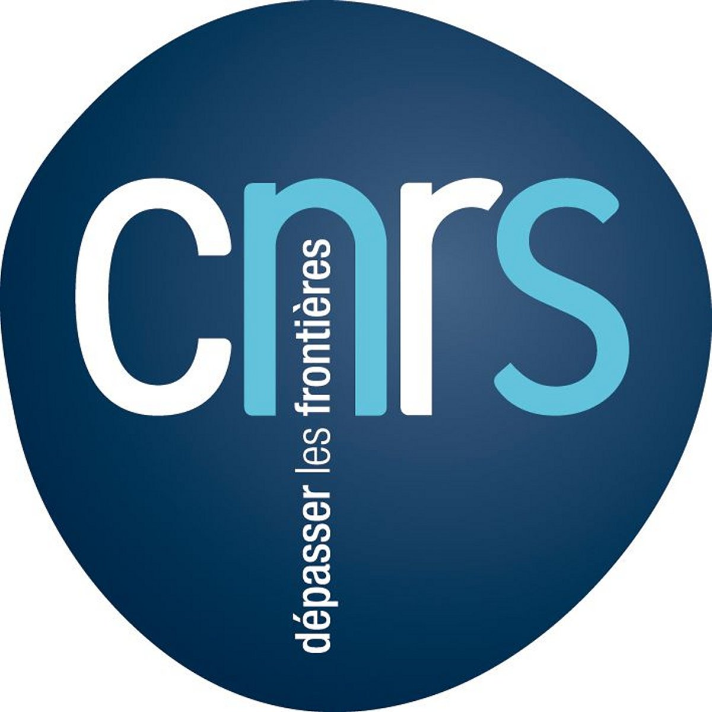
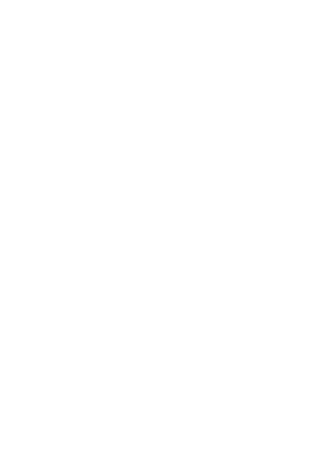
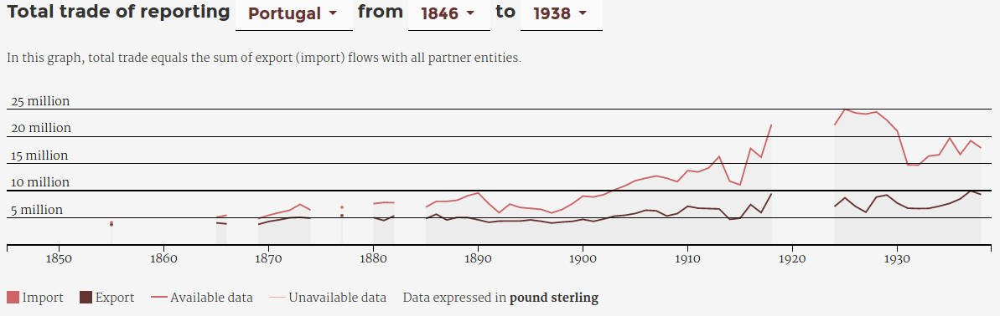
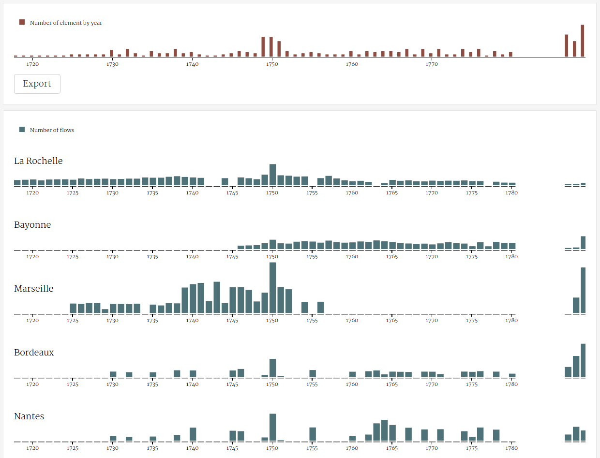

<div style="text-align: center"></div>
<h1 id="main">Des archives du commerce<br>à des données quantifiables<br><em> une longue chaîne de transformation des données</em></h1>

<p align="center">
  Paul Girard<br>
  Sciences Po, médialab
</p>

<p align="center">
 <small>Collecter et produire des données pour la recherche en SHS<br>
  Axe 2 : Collecter des données pour les exploiter : comment les préparer en amont ?<br>
  Fréjus, le 16 novembre 2016
  </small>
</p>
<div style="padding-left:45px"></div>

===

* Conception de méthodes numériques
* Hybridant les approches qualitatives et quantitatives
* Développant des outils-logiciels
* En Sciences Humaines et Sociales
===
<h1 id="main">Des archives du commerce<br>à des données quantifiables<br><em> une longue chaîne de transformation des données</em></h1>
* Retour d'expérience des projets:
  * [RICardo](http://ricardo.medialab.sciences-po.fr)
  * [TOFLIT18](https://toflit18.hypotheses.org/)
* Des archives aux données ?
* Quelles bases de données ?
* L'exploration visuelle au service des données

<p class="smaller">
Latour, Bruno. 1993. <em>‘Le Topofil de Boa-Vista. La Référence Scientifique: Montage Photophilosophique’</em>. Raisons Pratiques 4: 187–216.
</p>
===

## RICardo ⋅ XIXème siècle

<p align="center"><em>données annuelles</em><br> 
1787 ⋅ ⋅ ⋅ ⋅ ⋅ ⋅ ⋅ ⋅ ⋅ ⋅ ⋅ ⋅ 1938</p>

===

## RICardo ⋅ commerce bilateral
<p align="center">
Flux de commerce entre ~~pays~~ entités  
**A <⋅⋅> B**</p>

===

<p align="center" style="margin: 0;">
<!-- .element: style="width:50%; background-color: black; margin-top: 0;"-->
</p>

===

## RICardo ⋅ commerce total
<p align="center">
Flux de commerce entre les entités A et le monde  
**A <⋅⋅> M**</p>

===

## TOFLIT18: le XVIIIème siècle

<p align="center"><em>données annuelles</em><br>

1719 ⋅ ⋅ ⋅ ⋅ ⋅ ⋅ ⋅ ⋅ ⋅ ⋅ ⋅ ⋅ 1839</p>

===

## TOFLIT18: commerce de la France

Flux de commerce entre la France et ses partenaires commerciaux<br>
**France <⋅⋅> A,B,C**<br>
*rapportés par l'état français*

===

## TOFLIT18: les produits

#### Top 50 des produits

<p class="smaller">
Articles réunis ⋅ Indigo ⋅ Mercerie ⋅ Eau de vie ⋅ Librairie ⋅ Vinaigre ⋅ Cacao ⋅ Suif ⋅ Beurre ⋅ Alun ⋅ Liqueurs ⋅ Sel ⋅ Fromage ⋅ Rocou ⋅ Confitures ⋅ Acier ⋅ Fer ; en barres ⋅ Thé ⋅ Huile d'olive ⋅ Porcelaine ⋅ Poivre ⋅ Farine ⋅ Miel ⋅ Chandelle ⋅ Huile ; d'olive ⋅ Fayance ⋅ Savon ⋅ Amidon ⋅ Ris ⋅ Verdet ⋅ Bierre ⋅ Cochenille ⋅ Légumes ⋅ Bijouterie ⋅ Garance ⋅ Horlogerie ⋅ Chocolat ⋅ Meubles ⋅ Quinquina ⋅ Amandes ⋅ Crin ⋅ Papier ; blanc ⋅ Planches ; de sapin ⋅ Jambons ⋅ Lard ⋅ Drogues réunies ⋅ Argenterie ⋅ Bougie ⋅ Gaudron ⋅ Cuivre...
</p>

===

## Des sources aux données
<p align="center">
Volumes d'archives > images > **?** > chercheurs
</p>
===

## Transcription manuelle
<p align="center">

</p>
===

<!-- .slide: data-background-image="./assets/open_refine_ricardo.png"-->


===

## Diagnostique des données

* Contrôle qualité des données par script
* Analyse quantitative comme aide au nettoyage qualitatif

===
## Rapport de test-données de Ricardo
```python
# RICnames TEST
0 missing reporting in RICnames
0 missing partners in RICnames
missings written in out_data
# CURRENCY TEST
total number of currencies in flow 12366
check number before/after set currency : 12366/12366
check number before/after set modified_currency : 16382/16382
in currency not in flow 4016
in flow not in currency 0
in flow and in currency 12366
in flow in currency not in rate 1
total known currencies in flow 12365
missign rates exported in out_data
# EXP IMP TEST
missing expimp spe/gen in standards :0
EXP IMP TEST : OK
# FLOWS DUPLICATES TEST
## Spe/gen Dups
   number of spe/gen to clean 0
   reporting countries with spe/gen dups :
## dups
   number of dups to clean 166
   reporting countries with  dups :
   Algeria: 8 flows
   Portugal: 12 flows
   Sri Lanka (Ceylon): 2 flows
   British Somaliland (Somaliland Republic): 14 flows
   United States of America: 10 flows
   Malta: 4 flows
   Straits Settlements: 6 flows
   United Kingdom: 60 flows
   Bermuda: 2 flows
   New Hebrides: 32 flows
   Lisbon: 2 flows
   Spain: 2 flows
   Zanzibar: 12 flows
#TOTAL TRADE TEST
470 undefined type of Total Trade to World
21828 number of reporting exp or imp total annual flows on 255193 total

repartition of type of Total Trade to World as duplicates:

20892 95.7% flows compatible with world view
17388 79.7% flows compatible with world view
22 flows to World with only undefined Total

isolating World_undefined-only flows :
Reporting: Bremen, 22 cases, years: 1848|1848|1849|1849|1850|1850|1851|1851|1852|1852|1853|1853|1854|1854|1857|1857|1862|1862|1863|1863|1872|1872
```

Note: switch to yomgui
===

<p align="center">
  
</p>

===

## La calendrier Républicain

Converti au format calendrier grégorien.

```js
const AN_REGEX = /An (\d+)/i;

export function normalizeYear(year) {
  const m = year.match(AN_REGEX);

  if (!m)
    return +year;

  const nb = m[1];

  if (nb < 2 || nb > 14)
    throw Error(
      `toflit18.republican_calendar.normalizeYear: invalid year ${year}.`
    );

  return 1792 + (+nb);
}
```

===

## Contrôle de version des données

- [git](https://git-scm.com/) - contrôle de version pour les codes sources 
- Appliqué à la gestion de corpus de données
- Implique des fichiers texte brut

===

## fichier texte brut

- Les fichiers texte brut facilitent les traitements informatiques.
- CSV, JSON, XML sont des formats de fichier texte brut.
- Non, XLS, XLSX et ODT n'en sont pas.

===

<!-- .slide: data-background-image="./assets/github_toflit18.png"-->

===

<!-- .slide: data-background-image="./assets/github_data.png"-->

===

<!-- .slide: data-background-image="./assets/internetarchive_statisticalabstract.png"-->
<a href="https://archive.org/stream/statisticalabstr2318grea#page/166/mode/2up" target="_blank" style="background:black; padding:20px">Statistical abstract, P. 166 @ Internet Archive</a>

===

## Prendre soin des données

* Contrôles qualité des données
* Hybridant des approches qualitatives et quantitatives

===

## Bases de données

* Les base de données facilitent accès et manipulation
* Le choix de la technologie dépends des usages

===


<small>collaboration avec Karine ONFROY G.R.E.T.h.A (UMR CNRS 5113) Bordeaux</small>

===
## Toflit18 [NEO4J](https://neo4j.com/) schema


===

## Classifications

Un des objectifs principaux de TOFLIT18 :  
créer des classifications dédiées aux questions de recherche.

===

<!-- .slide: data-background-image="./assets/toflit18_classifications.png"-->

===
## base de données en graphe
Le modèle a été conçu pour proposer des **classifications** :

- **hiérarchiques** : aggrégation progressive
- **concurrentes** : aggrégation dédiée à une question
- **dynamiques** : toute analyse commence par un choix de classification

===

## la base de données TOFLIT18

- 419729 flux
- 47732 produits
- 843 pays
- 51 bureaux de commerce français
- 120 années
- 807 volumes d'archive

===

## la base de données RICardo

- 294138 flux
- 1492 RICentities
- 152 années
- 120 monnaies
- 7206 taux de change vers le £
- 73 types de sources (919 volumes)

===

## L'exploration visuelle au service des données

*Datascape*:
- Des visualisations de données intéractives
- Proposant divers points de vue sur les données 
- Aide à s'approprier la complexité par les dynamiques d'exploration
  
<small>**Leclercq, C. and Girard, P.** (2013). *The Experiments in Art and Technology Datascape*. Collections Électroniques de l’INHA. Actes de Colloques et Livres En Ligne de l’Institut National D’histoire de L’art. INHA http://inha.revues.org/4926 (accessed 27 October 2015). </small>

===

## Concevoir un datascape

Ateliers appelés *«data sprints»* avec:

- historiens
- économistes 
- développeurs
- designers

Traitant les enjeux de **contenu**, **implémentation** et de **design**  
en même temps et au même endroit.

===

## Analyse Exploratoire de Données

> « The greatest value of a picture is when it
forces us to notice what we never expected to
see. »  
Tukey, J. W. 

<small>**Tukey, J. W.** (1977). *Exploratory Data Analysis*. Addison-Wesley Publishing Company.</small>

===
<!-- .slide: data-transition="none"-->

## Visualisation de données

  

⬆ oups !  <!-- .element: class="fragment" data-fragment-index="1" style="margin-left:400px"-->  

===
<!-- .slide: data-transition="none"-->
## Vérifier et corriger les données

  
  
\- corrigé comme indiqué [slide 20](./#/20) -

===

<a href="http://ricardo.medialab.sciences-po.fr/#/metadata" target="_blank">La vue métadonnée de Ricardo</a> <!-- .element: style="margin:0px"--> 
 <!-- .element: style="margin:0px"--> 


===

<a href="http://toflit18.medialab.sciences-po.fr/#/exploration/meta" target="_blank">La vue métadonnée de  TOFLIT18</a> <!-- .element: style="margin:0px"--> 
 <!-- .element: style="margin:0px"--> 

===

### La chaîne de transformations
volumes d'archive > images > excel > git(csv) > base de données > visualisation de données **> csv**<!-- .element: class="fragment" data-fragment-index="1"-->

===

Un avant goût de l'atelier TOFLIT18/Ricardo

<!-- .element: style="height:450px"--> 

Co-occurrences de termes dans les noms de produits  
dans les exports de "La Rochelle" entre 1720 et 1729

Rendez vous ce soir à 18h30.

Note: switch to pom

===
### Les enjeux liés à la visualisation de données historiques

[medialab.github.io/ricardo](http://medialab.github.io/ricardo/#/)

<small>**Girard, P., Dedinger, B., Ricci, D., Ooghe-Tabanou, B., Jacomy, M., Plique, G. and Tible, G.** (2016). RICardo Project : Exploring XIX Century International Trade. Kraków, Poland http://ricardo.medialab.sciences-po.fr/Girardetal_RICardo_dh2016_en.pdf.</small>

===

## Science ouverte

- télécharger les données des visualizations en csv
- corpus de données seront ouverts en 2017  
CC BY-SA
- RICardo : [http://ricardo.medialab.sciences-po.fr](http://ricardo.medialab.sciences-po.fr)
- sources RICardo : [github.com/medialab/ricardo](https://github.com/medialab/ricardo)
- sources TOFLIT18 : [github.com/medialab/toflit18](https://github.com/medialab/toflit18)
- cette présentation: [http://medialab.github.io/toflit18/ANFmateSHS](https://medialab.github.io/toflit18/ANFmateSHS)    

===

## Bibliographie & Liens (1/2)

<p class="smaller">
Dedinger, Béatrice, and Paul Girard. 2016. <em>‘Exploring Trade Globalization in the Long Run : The RICardo Project’</em>. Historical Methods.
<br>
[http://ricardo.medialab.sciences-po.fr](http://ricardo.medialab.sciences-po.fr).
</p>

<p class="smaller">
Girard, Paul, Béatrice Dedinger, Donato Ricci, Benjamin Ooghe-Tabanou, Mathieu Jacomy, Guillaume Plique, and Grégory Tible. 2016. <em>‘RICardo Project : Exploring XIX Century International Trade’. In . Kraków, Poland.</em>
<br>
[http://ricardo.medialab.sciences-po.fr/Girardetal_RICardo_dh2016_en.pdf](http://ricardo.medialab.sciences-po.fr/Girardetal_RICardo_dh2016_en.pdf).
</p>

===

## Bibliographie & Liens (2/2)

<p class="smaller">
Latour, Bruno. 1993. <em>‘Le Topofil de Boa-Vista. La Référence Scientifique: Montage Photophilosophique’</em>. Raisons Pratiques 4: 187–216.
</p>

<p class="smaller">
Latour, Bruno, Pablo Jensen, Tommaso Venturini, Sébastian Grauwin, and Dominique Boullier. 2012. <em>‘“The Whole Is Always Smaller than Its Parts” - a Digital Test of Gabriel Tardes’ Monads’</em>. The British Journal of Sociology 63 (4): 590–615. doi:10.1111/j.1468-4446.2012.01428.x.
</p>

<p class="smaller">
Tukey, John Wilder. 1977. <em>Exploratory Data Analysis</em>. Addison-Wesley Publishing Company.
</p>

