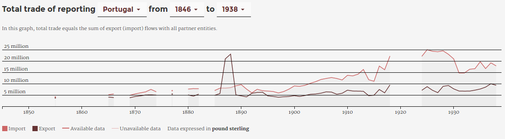
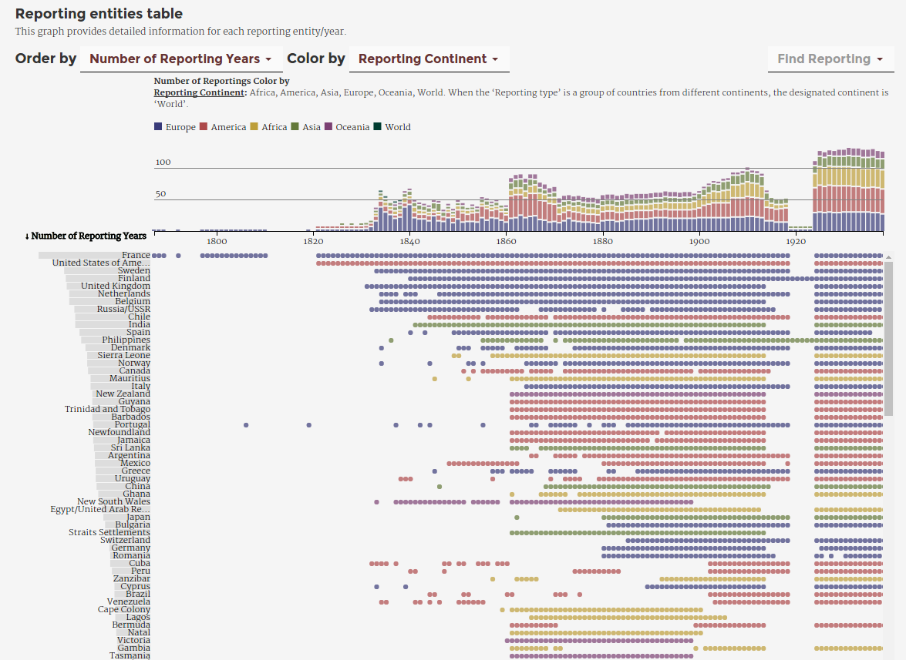
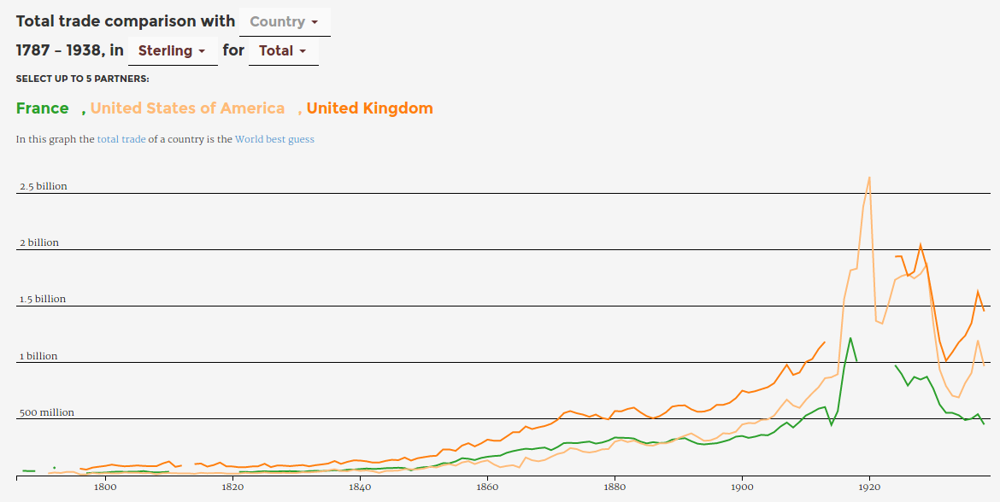
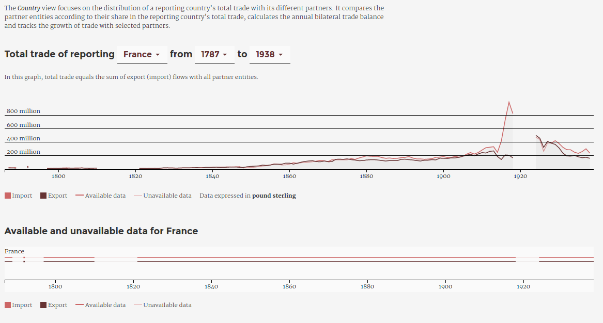

<h1 id="main">Organizing the reversible chain of transformations<br><em>From trade statistics records to datascapes</em></h1>

<p align="center">
  Paul Girard & Guillaume Plique<br>
  Sciences Po médialab
</p>

<p align="center">
 <small>
  <em>From Quantitative to Qualitative Analysis:<br> New Perspectives on Research in Social History</em><br>
  Neubauer Collegium for Culture and Society<br>
  10/14/2016
  </small>
</p>

===

* Designing digital methods
* Mixing qualitative & quantitative approaches
* Developing software
* In social sciences & humanities

===

## RICardo ⋅ 19th century

<p align="center"><em>year by year</em><br> 
1787 ⋅ ⋅ ⋅ ⋅ ⋅ ⋅ ⋅ ⋅ ⋅ ⋅ ⋅ ⋅ 1938</p>

===

## RICardo ⋅ bilateral trade
<p align="center">
Trade flows between ~~countries~~ entities  
**A <⋅⋅> B**</p>

===

<p align="center" style="margin: 0;">
<!-- .element: style="width:50%; background-color: black; margin-top: 0;"-->
</p>

===

## RICardo ⋅ Total trade
<p align="center">
Trade flows between entity A and the world  
**A <⋅⋅> W**</p>

Note: switch to yomgui
===

## Toflit18: the 18th century

<p align="center"><em>year by year</em><br>

1719 ⋅ ⋅ ⋅ ⋅ ⋅ ⋅ ⋅ ⋅ ⋅ ⋅ ⋅ ⋅ 1839</p>

===

## TOFLIT18: French trade

Trade flows between France and other countries<br>
**France <⋅⋅> A,B,C**<br>
*as reported by France*

===

## TOFLIT18: products

#### Top 50 TOFLIT18 products

<p class="smaller">
Articles réunis ⋅ Indigo ⋅ Mercerie ⋅ Eau de vie ⋅ Librairie ⋅ Vinaigre ⋅ Cacao ⋅ Suif ⋅ Beurre ⋅ Alun ⋅ Liqueurs ⋅ Sel ⋅ Fromage ⋅ Rocou ⋅ Confitures ⋅ Acier ⋅ Fer ; en barres ⋅ Thé ⋅ Huile d'olive ⋅ Porcelaine ⋅ Poivre ⋅ Farine ⋅ Miel ⋅ Chandelle ⋅ Huile ; d'olive ⋅ Fayance ⋅ Savon ⋅ Amidon ⋅ Ris ⋅ Verdet ⋅ Bierre ⋅ Cochenille ⋅ Légumes ⋅ Bijouterie ⋅ Garance ⋅ Horlogerie ⋅ Chocolat ⋅ Meubles ⋅ Quinquina ⋅ Amandes ⋅ Crin ⋅ Papier ; blanc ⋅ Planches ; de sapin ⋅ Jambons ⋅ Lard ⋅ Drogues réunies ⋅ Argenterie ⋅ Bougie ⋅ Gaudron ⋅ Cuivre...
</p>

Note: switch to pom
===

## From sources to data
<p align="center">
archived books > pictures > **?** > researchers
</p>
===

## Manual transcription
<p align="center">

</p>
===

<!-- .slide: data-background-image="./assets/open_refine_ricardo.png"-->

Note: cleaning Ricardo with Open Refine

===

## Data troubleshooting

* Data quality automatic checks
* Quantitative analysis to feed qualitative cleaning

===
## Ricardo data-test report
```python
# RICnames TEST
0 missing reporting in RICnames
0 missing partners in RICnames
missings written in out_data
# CURRENCY TEST
total number of currencies in flow 12366
check number before/after set currency : 12366/12366
check number before/after set modified_currency : 16382/16382
in currency not in flow 4016
in flow not in currency 0
in flow and in currency 12366
in flow in currency not in rate 1
total known currencies in flow 12365
missign rates exported in out_data
# EXP IMP TEST
missing expimp spe/gen in standards :0
EXP IMP TEST : OK
# FLOWS DUPLICATES TEST
## Spe/gen Dups
   number of spe/gen to clean 0
   reporting countries with spe/gen dups :
## dups
   number of dups to clean 166
   reporting countries with  dups :
   Algeria: 8 flows
   Portugal: 12 flows
   Sri Lanka (Ceylon): 2 flows
   British Somaliland (Somaliland Republic): 14 flows
   United States of America: 10 flows
   Malta: 4 flows
   Straits Settlements: 6 flows
   United Kingdom: 60 flows
   Bermuda: 2 flows
   New Hebrides: 32 flows
   Lisbon: 2 flows
   Spain: 2 flows
   Zanzibar: 12 flows
#TOTAL TRADE TEST
470 undefined type of Total Trade to World
21828 number of reporting exp or imp total annual flows on 255193 total

repartition of type of Total Trade to World as duplicates:

20892 95.7% flows compatible with world view
17388 79.7% flows compatible with world view
22 flows to World with only undefined Total

isolating World_undefined-only flows :
Reporting: Bremen, 22 cases, years: 1848|1848|1849|1849|1850|1850|1851|1851|1852|1852|1853|1853|1854|1854|1857|1857|1862|1862|1863|1863|1872|1872
```

Note: switch to yomgui
===

## TOFLIT18 - The republican calendar

===

## Data versionning

- [git](https://git-scm.com/) - a software source code version constrol system 
- Applied to data corpus management
- Implies textual formats for data files

===

## Textual formats

- Textual format ease computational treatments
- CSV, Json, xml are textual formats
- No, xls, xlsx and odt are not textual formats.

===

<!-- .slide: data-background-image="./assets/github_toflit18.png"-->

Note: switch to pom

===

<!-- .slide: data-background-image="./assets/github_data.png"-->

===

<!-- .slide: data-background-image="./assets/internetarchive_statisticalabstract.png"-->
<a href="https://archive.org/stream/statisticalabstr2318grea#page/166/mode/2up" target="_blank" style="background:black; padding:20px">Statistical abstract, P. 166 @ Internet Archive</a>

===

## Data Care

* Towards data quality
* Mixing qualitative and quantitative work

===

## From data to database

* databases leverage access to data
* one database choice depends on usages

===


Note: switch to Yomgui
===

## network database for a flexible classifications system

schema neo4J Agent Smith

===

## Classifications
Comment faire en sorte que le truc soit utilisable par plusieurs chercheurs 
+ rewire

===

## TOFLIT18 database volumetry

- 419,729 flows
- 47,732 products
- 843 countries
- 51 custom french bureaux
- 120 years
- 807 source volumes

Note: switch to pom

===

## RICardo database volumetry

- 294,138 flows
- 1,492 RICentities
- 152 years
- 120 currencies
- 7,206 exchange rates to £
- 73 source types (919 volumes)

===

## Exploring complexity through a datascape

- Dedicated interactive data visualisations
- Propose different focus on the database
- Handle complexity through dynamic exploration
  
<small>**Leclercq, C. and Girard, P.** (2013). *The Experiments in Art and Technology Datascape*. Collections Électroniques de l’INHA. Actes de Colloques et Livres En Ligne de l’Institut National D’histoire de L’art. INHA http://inha.revues.org/4926 (accessed 27 October 2015). </small>

===

## Building a datascape

Workshop called *«data sprints»* with:

- historians
- economists 
- developers
- designers

Addressing **content**, **implementation** and **design** issues  
 at the same time, in the same place. 

===

## Exploratory Data Analysis

> « The greatest value of a picture is when it
forces us to notice what we never expected to
see. »  
John W. Tukey
  
<small>**Tukey, J. W.** (1977). *Exploratory Data Analysis*. Addison-Wesley Publishing Company.</small>

===
<!-- .slide: data-transition="none"-->

## Visualize the data

  

⬆ oups !  <!-- .element: class="fragment" data-fragment-index="1" style="margin-left:400px"-->  

===
<!-- .slide: data-transition="none"-->
## Check and correct the data

  
  
\- better - <!-- .element: style="margin-left:400px"--> 

===

<a href="http://ricardo.medialab.sciences-po.fr/#/metadata" target="_blank">Ricardo metadata view</a> <!-- .element: style="margin:0px"--> 
 <!-- .element: style="margin:0px"--> 

Note: switch to yomgui

===

<a href="http://toflit18.medialab.sciences-po.fr/#/exploration/meta" target="_blank">Toflit18 metadata view</a> <!-- .element: style="margin:0px"--> 
 <!-- .element: style="margin:0px"--> 

===

## TOFLIT18 tour

Note: switch to pom
===
## How to explore RICardo complexity ? 

*Three progressive focus:*

**World** > **Country** > **Bilateral**  

*one visual documentation:*

**Metadata**

===
## RICardo World view - general

===
## RICardo World view - detail

===
## RICardo Country view

===
## RICardo Country view - trade partners

===
## RICardo Bilateral view


<small>**Dedinger, B.** (2012). The Franco-German trade puzzle: an analysis of the economic consequences of the Franco-Prussian war1: THE FRANCO-GERMAN TRADE PUZZLE. *The Economic History Review*, 65(3): 1029–54 doi:10.1111/j.1468-0289.2011.00604.x.</small>
  
  
<small>**Don, Y.** (1968). Comparability of International Trade Statistics: Great Britain and Austria-Hungary
before World War I. *The Economic History Review* 21:78-92.</small>

===
## About visualizing historical data issues

[medialab.github.io/ricardo](http://medialab.github.io/ricardo/#/)

<small>**Girard, P., Dedinger, B., Ricci, D., Ooghe-Tabanou, B., Jacomy, M., Plique, G. and Tible, G.** (2016). RICardo Project : Exploring XIX Century International Trade. Kraków, Poland http://ricardo.medialab.sciences-po.fr/Girardetal_RICardo_dh2016_en.pdf.</small>

===

### Produce your own understanding of 18/19th century French/World trade

<a href="http://ricardo.medialab.sciences-po.fr" target="_blank">http://ricardo.medialab.sciences-po.fr</a>

<a href="http://toflit18.medialab.sciences-po.fr" target="_blank">http://toflit18.medialab.sciences-po.fr</a>

===

### Organizing the reversible chain of transformations
archived books > pictures > excel > git(csv) > database > data viz > csv


===

## Open Science

- download the visualizations' datasets in csv
- complete datasets to be released in 2017
- RICardo source code: [github.com/medialab/ricardo](https://github.com/medialab/ricardo)
- TOFLIT18 source code: [github.com/medialab/toflit18](https://github.com/medialab/toflit18)
- this presentation: [http://medialab.github.io/toflit18/chicago](https://medialab.github.io/toflit18/chicago)    

===

## Bibliography & Links (1/2)

<p class="smaller">
Dedinger, Béatrice, and Paul Girard. 2016. <em>‘Exploring Trade Globalization in the Long Run : The RICardo Project’</em>. Historical Methods.
<br>
[http://ricardo.medialab.sciences-po.fr](http://ricardo.medialab.sciences-po.fr).
</p>

<p class="smaller">
Girard, Paul, Béatrice Dedinger, Donato Ricci, Benjamin Ooghe-Tabanou, Mathieu Jacomy, Guillaume Plique, and Grégory Tible. 2016. <em>‘RICardo Project : Exploring XIX Century International Trade’. In . Kraków, Poland.</em>
<br>
[http://ricardo.medialab.sciences-po.fr/Girardetal_RICardo_dh2016_en.pdf](http://ricardo.medialab.sciences-po.fr/Girardetal_RICardo_dh2016_en.pdf).
</p>

===

## Bibliography & Links (2/2)

<p class="smaller">
Latour, Bruno. 1993. <em>‘Le Topofil de Boa-Vista. La Référence Scientifique: Montage Photophilosophique’</em>. Raisons Pratiques 4: 187–216.
</p>

<p class="smaller">
Latour, Bruno, Pablo Jensen, Tommaso Venturini, Sébastian Grauwin, and Dominique Boullier. 2012. <em>‘“The Whole Is Always Smaller than Its Parts” - a Digital Test of Gabriel Tardes’ Monads’</em>. The British Journal of Sociology 63 (4): 590–615. doi:10.1111/j.1468-4446.2012.01428.x.
</p>

<p class="smaller">
Tukey, John Wilder. 1977. <em>Exploratory Data Analysis</em>. Addison-Wesley Publishing Company.
</p>

