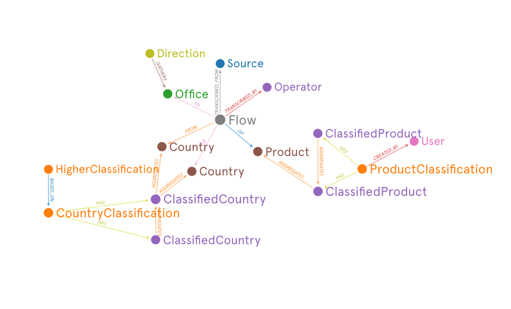
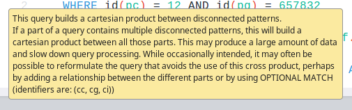
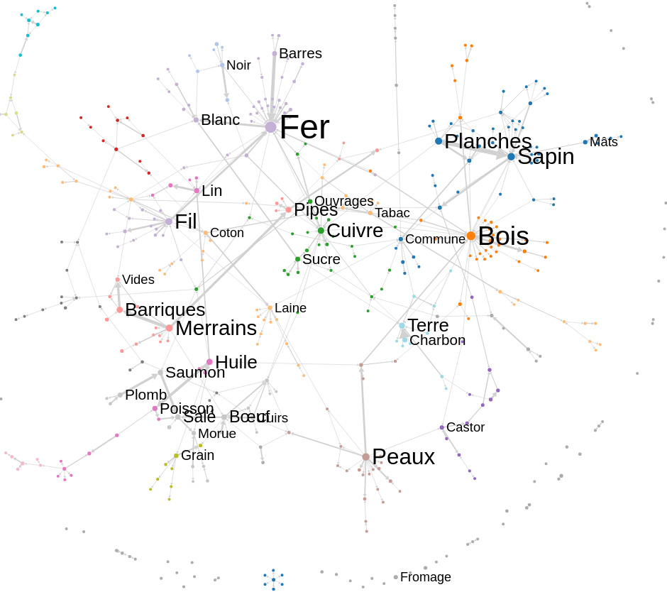

# Using networks to study 18th century French trade
Paul Girard [@paulanomalie](http://twitter.com/paulanomalie)  
Guillaume Plique [@yomguithereal](https://twitter.com/yomguithereal)  
  
[Sciences Po, médialab, Paris, France](http://medialab.sciencespo.fr) - [ANR TOFLIT18](https://toflit18.hypotheses.org/)  
[FOSDEM'19, Graph dev room, February the 2nd 2019](https://fosdem.org/2019/schedule/event/graph_french_trade_study/)

---

> France has started to compile **statistics about its trade<br>since 1716**.  

The "Bureau de la Balance du Commerce" (Balance of Trade's Office) centralized local reports of imports/exports by commodities produced by french tax regions.  
Many statistical manuscript volumes produced by this process have been preserved in French archives.

---

---
<blockquote>
How and why we used network technologies to create a **research instrument**¹ based on the transcriptions of those archives in the TOFLIT18² research project. 
</blockquote>

¹ *To explore visually 18th century French trade*  
² *Transformations of the french economy through the lens of international trade*
---
<blockquote>
Our corpus is composed of  
<span class="fragment">+500k yearly trade transactions </span>   
<span class="fragment">of one commodity</span>  
<span class="fragment">between a French local tax region or a foreign country</span>  
<span class="fragment">between 1718 and 1838.</span> 
</blockquote>

---
### 18th century

<p align="center">
<em>year by year</em><br>

1718 ⋅ ⋅ ⋅ ⋅ ⋅ ⋅ ⋅ ⋅ ⋅ ⋅ ⋅ ⋅ 1838</p>

---

### French trade flows
<p align="center">

French cities *<⋅⋅⋅⋅ flow ⋅⋅⋅⋅>* countries<br>

547,937 trade flows


</p>
---

<blockQuote>
We had to design  
a classification system  
to reduce the heterogeneity of the commodity names.
</blockQuote>
---
## Products

**Top 50 products on 55,804**

<p class="smaller">
Articles réunis ⋅ Indigo ⋅ Mercerie ⋅ Eau de vie ⋅ Librairie ⋅ Vinaigre ⋅ Cacao ⋅ Suif ⋅ Beurre ⋅ Alun ⋅ Liqueurs ⋅ Sel ⋅ Fromage ⋅ Rocou ⋅ Confitures ⋅ Acier ⋅ Fer ; en barres ⋅ Thé ⋅ Huile d'olive ⋅ Porcelaine ⋅ Poivre ⋅ Farine ⋅ Miel ⋅ Chandelle ⋅ Huile ; d'olive ⋅ Fayance ⋅ Savon ⋅ Amidon ⋅ Ris ⋅ Verdet ⋅ Bierre ⋅ Cochenille ⋅ Légumes ⋅ Bijouterie ⋅ Garance ⋅ Horlogerie ⋅ Chocolat ⋅ Meubles ⋅ Quinquina ⋅ Amandes ⋅ Crin ⋅ Papier ; blanc ⋅ Planches ; de sapin ⋅ Jambons ⋅ Lard ⋅ Drogues réunies ⋅ Argenterie ⋅ Bougie ⋅ Gaudron ⋅ Cuivre...
</p>
---

## Orthographic clustering

<p class="smaller">
Articles réunis ⋅ Indigo ⋅ Mercerie ⋅ Eau de vie ⋅ Librairie ⋅ Vinaigre ⋅ Cacao ⋅ Suif ⋅ Beurre ⋅ Alun ⋅ Liqueurs ⋅ Sel ⋅ Fromage ⋅ Rocou ⋅ Confitures ⋅ Acier ⋅ Fer ; en barres ⋅ Thé ⋅ **Huile d'olive** ⋅ Porcelaine ⋅ Poivre ⋅ Farine ⋅ Miel ⋅ Chandelle ⋅ **Huile ; d'olive** ⋅ Fayance ⋅ Savon ⋅ Amidon ⋅ Ris ⋅ Verdet ⋅ Bierre ⋅ Cochenille ⋅ Légumes ⋅ Bijouterie ⋅ Garance ⋅ Horlogerie ⋅ Chocolat ⋅ Meubles ⋅ Quinquina ⋅ Amandes ⋅ Crin ⋅ Papier ; blanc ⋅ Planches ; de sapin ⋅ Jambons ⋅ Lard ⋅ Drogues réunies ⋅ Argenterie ⋅ Bougie ⋅ Gaudron ⋅ Cuivre...
</p>
---

## Thematic clustering

<p class="smaller">
Articles réunis ⋅ Indigo ⋅ Mercerie ⋅ **Eau de vie** ⋅ Librairie ⋅ Vinaigre ⋅ Cacao ⋅ Suif ⋅ Beurre ⋅ Alun ⋅ **Liqueurs** ⋅ Sel ⋅ Fromage ⋅ Rocou ⋅ Confitures ⋅ Acier ⋅ Fer ; en barres ⋅ Thé ⋅ Huile d'olive ⋅ Porcelaine ⋅ Poivre ⋅ Farine ⋅ Miel ⋅ Chandelle ⋅ Huile ; d'olive ⋅ Fayance ⋅ Savon ⋅ Amidon ⋅ Ris ⋅ Verdet ⋅ **Bierre** ⋅ Cochenille ⋅ Légumes ⋅ Bijouterie ⋅ Garance ⋅ Horlogerie ⋅ Chocolat ⋅ Meubles ⋅ Quinquina ⋅ Amandes ⋅ Crin ⋅ Papier ; blanc ⋅ Planches ; de sapin ⋅ Jambons ⋅ Lard ⋅ Drogues réunies ⋅ Argenterie ⋅ Bougie ⋅ Gaudron ⋅ Cuivre...
</p>
---

## Classification tree

**hierarchic**: progressive aggregation  
**concurrent**: alternative ways to aggregate
  
```python
source  
	orthographic normalization # same word different spelling  
		simplication  # different word same meaning
			# thematic classifications
			Medicinal products  
			Hamburg classification  
			Canada  
			Eden treaty  
			Grains  
			Coton  
			SITC  
				SITC FR  
				SITC EN
```         
---
<blockQuote>
Our research instruments provides  
exploratory data analysis  
to economic historians.
</blockQuote>
---

## Démo time
[http://toflit18.medialab.sciences-po.fr](http://toflit18.medialab.sciences-po.fr)

With more content related findings
at Digital Humanities 2019, Rotterdam, NL  
  
*I hope, paper under review.*

Note: 
1- classification view, product orthographic, simplification, canada, canada on source 
2- metadata view: Direction, Canada (exclusivement Canada), Total
3- time series: Local, Canada (exclusivement Canada), La Rochelle | Marseille
---


<blockQuote>
We used a graph database, **[neo4j](https://neo4j.com/)**  
to modelize our data  
as a trade network  
where trade flows are edges between trade partners.
</blockQuote>

---

#### why ? 
- trade flows actually form a network
- to dynamicaly aggregate flows by any classification
- to be able to change classifications without having to reindex
- because we used it with pleasure [see FOSDEM 2016](https://archive.fosdem.org/2016/schedule/event/graph_processing_mysql_to_graph/)

---
## network as a data model


---
Till somewhere in 2015-6
<center>
<!-- .element: style="width:100%;margin-top: 0;" title="warning:  This query builds a cartesian product between disconnected patterns.If a part of a query contains multiple disconnected patterns, this will build a cartesian product between all those parts. This may produce a large amount of data and slow down query processing. While occasionally intended, it may often be possible to reformulate the query that avoids the use of this cross product, perhaps by adding a relationship between the different parts or by using OPTIONAL MATCH (identifiers are: ())"-->  
A lot of cartesian products later...
</center>
---
Till November the 23rd 2016
```
MATCH  (pc)-[:HAS]->(pg)-[:AGGREGATES*1..]->(pi)  
WHERE id(pc) = 12 AND id(pg) = 657832  
WITH collect(pi.name) AS products  
	MATCH (cc)-[:HAS]->(cg)-[:AGGREGATES*1..]->(ci)  
	WHERE id(cc) = 16 AND id(cg) = 658498  
	WITH products, collect(ci.name) AS countries  
		MATCH (f:Flow)  
		WHERE  
			f.sourceType = "Local"  
			AND f.country IN countries   
			AND f.product IN products  
			AND f.direction = 'Nantes'  
		RETURN  count(f) AS count, sum(toFloat(f.value)) AS value, f.year AS year,  collect(distinct(f.direction)) as nb_direction, f.sourceType
		ORDER BY f.year;
```

---
Our specification
<blockquote>
to be able to change classifications without having to reindex
</blockquote>

---
This horrible solution implies to  
index the product nodes' value  
in the flow nodes.  
      
Thanks god only at source level  
  
It's a bad workaround leveraging lucene indices hidden inside Neo4J instead of using graph traversals.  
  
Traversal of what ?  
Of our **flow node**.  
---
The flow node is our **top degree node** in our data model graph.


---
<blockQuote>
Our classification system introduces the need for **hyperedges**.
</blockQuote>
This is the keyword which helped us find [the good path](https://neo4j.com/docs/stable/cypher-cookbook-hyperedges.html).
---

> I learned this  
on November the 23rd 2016  
while preparing a talk proposal  
to @graphdevroom 2017  
wich I didn't submit since I felt stupid.

---
<!-- .slide: data-background-image="./assets/github_commit_hyeredges.png"-->

[as this commit archived it](https://github.com/medialab/toflit18/commit/a5493ae8b399c374e043e8ba6bfa52275b9ed541#diff-bc5a4f5cd869b74189034f944b88641e))<!-- .element: style="background: rgba(255,255,255,0.8);padding:15px"-->

---
```
MATCH 
	(d:Direction)<-[:FROM|:TO]-(f:Flow),  
	(f:Flow)-[:OF]->(:Product)<-[:AGGREGATES*1..]-(pci:ClassifiedItem)<-[:HAS]-(pc:Classification),  
	(f:Flow)-[:FROM|:TO]->(c:Country),  
	(c:Country)<-[:AGGREGATES*1..]-(cci:ClassifiedItem)<-[:HAS]-(cc:Classification),  
	(f:Flow)-[:TRANSCRIBED_FROM]->(s:Source)
WHERE 
	id(d) = 23124 AND (id(pc) = 12 AND (id(pci) IN [657832])) AND (id(cc) = 16 AND (id(cci) IN [658498])) AND s.type = "Local"
RETURN 
	count(f) AS count, sum(toFloat(f.value)) AS value, f.year AS year,  collect(distinct(f.direction)) as nb_direction
ORDER BY year;
```
---

## Actually #1  	
An index-based memory structure  
like ElastiSearch  
would have done the job.  
Because we didn't have time to implement  
classification modification User Interface!

<span class='fragment'>Which we should do</span><span class='fragment'>, one day</span>  

---
## Actually #2  
Modifying a parent classification   
implies to update its children.  
We wrote an [already-sacred algorithm](https://github.com/medialab/toflit18/blob/master/scripts/rewire.js)   
to automatically rewire the tree  
using set theory.

---

> Exploratory data analysis  
on top of the neo4J database  
using JavaScript technologies

---

- *[Decypher](https://github.com/Yomguithereal/decypher)*
- Express *[dolman](https://github.com/Yomguithereal/dolman)*
- *[graphology](https://github.com/graphology/)*
- React
- *[Baobab](https://github.com/Yomguithereal/baobab)*
- *[SigmaJS](https://github.com/sigmajs)*

[@yomguithereal](https://twitter.com/yomguithereal) and [@jacomyal](https://twitter.com/jacomyal) on the team.

---
```JavaScript
import decypher from 'decypher';
import database from '../connection';
import filterItemsByIdsRegexps from './utils';

const {Expression, Query} = decypher;

const ModelCreateLine = {

  /**
   * Line creation.
   */
  createLine(params, callback) {
    const {
      sourceType,
      direction,
      kind,
      productClassification,
      product,
      countryClassification,
      country
    } = params;

    // Building the query
    const query = new Query(),
          where = new Expression(),
          match = [];

    // import export
    // define import export edge type filter
    let exportImportFilterDirection = ':FROM|:TO';
    let exportImportFilterCountry = ':FROM|:TO';
    if (kind === 'import') {
      exportImportFilterDirection = ':TO';
      exportImportFilterCountry = ':FROM';
      // add a where clause an flow import index to match flows which doesn't have a country or direction link
      where.and('f.import');
    }
    else if (kind === 'export') {
      exportImportFilterDirection = ':FROM';
      exportImportFilterCountry = ':TO';
      // add a where clause an flow import index to match flows which doesn't have a country or direction link
      where.and('NOT f.import');
    }

    //-- Should we match a precise direction?
    if (direction && direction !== '$all$') {
      match.push(`(d:Direction)<-[${exportImportFilterDirection}]-(f:Flow)`);
      where.and('id(d) = {direction}');
      query.params({direction: database.int(direction)});
    }

    //-- Do we need to match a product?
    if (productClassification) {
      match.push('(f:Flow)-[:OF]->(:Product)<-[:AGGREGATES*1..]-(pci:ClassifiedItem)<-[:HAS]-(pc:Classification)');
      const whereProduct = new Expression('id(pc) = {productClassification}');
      query.params({productClassification: database.int(productClassification)});


      if (product) {
        const productFilter = filterItemsByIdsRegexps(product, 'pci');

        whereProduct.and(productFilter.expression);
        query.params(productFilter.params);
      }
      where.and(whereProduct);
    }

    //-- Do we need to match a country?
    if (countryClassification) {
      // define import export edge type filter
      match.push(`(f:Flow)-[${exportImportFilterCountry}]->(c:Country)`);
      match.push('(c:Country)<-[:AGGREGATES*1..]-(cci:ClassifiedItem)<-[:HAS]-(cc:Classification)');

      const whereCountry = new Expression('id(cc) = {countryClassification}');
      query.params({countryClassification: database.int(countryClassification)});

      if (country) {
        const countryFilter = filterItemsByIdsRegexps(country, 'cci');

        whereCountry.and(countryFilter.expression);
        query.params(countryFilter.params);
      }

      where.and(whereCountry);
    }

    //-- Do we need to match a source type
    if (sourceType) {
      match.push('(f:Flow)-[:TRANSCRIBED_FROM]->(s:Source)');

      if (sourceType !== 'National best guess' && sourceType !== 'Local best guess') {
       where.and('s.type = {sourceType}');
       query.params({sourceType});
      }
      else if (sourceType === 'National best guess') {
       where.and('s.type IN ["Objet Général", "Résumé", "National toutes directions tous partenaires", "Tableau des quantités"]');
      }
      else if (sourceType === 'Local best guess') {
       where.and('s.type IN ["Local","National toutes directions tous partenaires"] and f.year <> 1749 and f.year <> 1751');
      }
    }

    if (match.length > 0)
      query.match(match);
    else
      query.match('(f:Flow)');

    if (!where.isEmpty())
      query.where(where);

    //-- Returning data
    const shares = 'sum(value) AS value_share, sum(kg) AS kg_share, sum(litre) AS litre_share, sum(nbr) AS nbr_share';

    if (sourceType && sourceType !== 'National best guess' && sourceType !== 'Local best guess') {
      query.with([
        'f',
        'CASE WHEN exists(f.value) AND f.value > 0 THEN 1 ELSE 0 END AS value',
        'CASE WHEN exists(f.quantity_kg) AND f.quantity_kg > 0 THEN 1 ELSE 0 END AS kg',
        'CASE WHEN exists(f.quantity_litre) AND f.quantity_litre > 0 THEN 1 ELSE 0 END AS litre',
        'CASE WHEN exists(f.quantity_nbr) AND f.quantity_nbr > 0 THEN 1 ELSE 0 END AS nbr'
      ]);
      query.return('count(f) AS count, sum(toFloat(f.value)) AS value, sum(toFloat(f.quantity_kg)) AS kg, sum(toFloat(f.quantity_nbr)) AS nbr, sum(toFloat(f.quantity_litre)) AS litre, f.year AS year,  collect(distinct(f.direction)) as nb_direction, f.sourceType, ' + shares);
      query.orderBy('f.year');
    }
    else if (sourceType === 'National best guess') {
      query.with('f.year AS year, collect(f) as flows_by_year, collect(distinct(f.sourceType)) as source_types');
      query.with('year, CASE  WHEN size(source_types)>1 and "Objet Général" in source_types THEN filter(fb in flows_by_year where fb.sourceType="Objet Général") WHEN size(source_types)>1 and "Tableau des quantités" in source_types THEN filter(fb in flows_by_year where fb.sourceType="Tableau des quantités") WHEN size(source_types)>1 and "Résumé" in source_types THEN filter(fb in flows_by_year where fb.sourceType="Résumé") WHEN size(source_types)>1 and "National toutes directions tous partenaires" in source_types THEN filter(fb in flows_by_year where fb.sourceType="National toutes directions tous partenaires") ELSE flows_by_year END as flowsbyyear UNWIND flowsbyyear as fs');
      query.with([
        'year',
        'fs',
        'CASE WHEN exists(fs.value) AND fs.value > 0 THEN 1 ELSE 0 END AS value',
        'CASE WHEN exists(fs.quantity_kg) AND fs.quantity_kg > 0 THEN 1 ELSE 0 END AS kg',
        'CASE WHEN exists(fs.quantity_litre) AND fs.quantity_litre > 0 THEN 1 ELSE 0 END AS litre',
        'CASE WHEN exists(fs.quantity_nbr) AND fs.quantity_nbr > 0 THEN 1 ELSE 0 END AS nbr'
      ]);
      query.return('year, fs.sourceType, count(fs) as count, sum(toFloat(fs.value)) as value, sum(toFloat(fs.quantity_kg)) AS kg, sum(toFloat(fs.quantity_nbr)) AS nbr, sum(toFloat(fs.quantity_litre)) AS litre, collect(distinct(fs.direction)) as nb_direction, ' + shares);
      query.orderBy('year');
    }
    else if (sourceType === 'Local best guess') {
      query.with(' f.year AS year, collect(f) as flows_by_year, collect(distinct(f.sourceType)) as source_types');
      query.with(' year, CASE  WHEN size(source_types)>1 and "Local" in source_types THEN filter(fb in flows_by_year where fb.sourceType="Local") WHEN size(source_types)>1 and "National toutes directions tous partenaires" in source_types THEN filter(fb in flows_by_year where fb.sourceType="National toutes directions tous partenaires") ELSE flows_by_year END as flowsbyyear UNWIND flowsbyyear as fs');
      query.with([
        'year',
        'fs',
        'CASE WHEN exists(fs.value) AND fs.value > 0 THEN 1 ELSE 0 END AS value',
        'CASE WHEN exists(fs.quantity_kg) AND fs.quantity_kg > 0 THEN 1 ELSE 0 END AS kg',
        'CASE WHEN exists(fs.quantity_litre) AND fs.quantity_litre > 0 THEN 1 ELSE 0 END AS litre',
        'CASE WHEN exists(fs.quantity_nbr) AND fs.quantity_nbr > 0 THEN 1 ELSE 0 END AS nbr'
      ]);
      query.return('year, fs.sourceType, count(fs) as count, sum(toFloat(fs.value)) as value, sum(toFloat(fs.quantity_kg)) AS kg, sum(toFloat(fs.quantity_nbr)) AS nbr, sum(toFloat(fs.quantity_litre)) AS litre, collect(distinct(fs.direction)) as nb_direction, ' + shares);
      query.orderBy('year');
    }
    else {
      query.with([
        'f',
        'CASE WHEN exists(f.value) AND f.value > 0 THEN 1 ELSE 0 END AS value',
        'CASE WHEN exists(f.quantity_kg) AND f.quantity_kg > 0 THEN 1 ELSE 0 END AS kg',
        'CASE WHEN exists(f.quantity_litre) AND f.quantity_litre > 0 THEN 1 ELSE 0 END AS litre',
        'CASE WHEN exists(f.quantity_nbr) AND f.quantity_nbr > 0 THEN 1 ELSE 0 END AS nbr'
      ]);
      query.return('count(f) AS count, sum(toFloat(f.value)) AS value, sum(toFloat(f.quantity_kg)) AS kg, sum(toFloat(f.quantity_nbr)) AS nbr, sum(toFloat(f.quantity_litre)) AS litre, f.year AS year,  collect(distinct(f.direction)) as nb_direction, ' + shares);
      query.orderBy('f.year');
    }

    database.cypher(query.build(), function(err, data) {

      if (err) return callback(err);

      return callback(null, data);
    });
  }
};

export default ModelCreateLine;

```

---
> Home brewed  
Open Source  
Data Science

http://github.com/medialab/toflit18

And soon all the data on github  
in a [datapackage format](https://frictionlessdata.io/specs/data-package/)  
*\#opendata*

---

> graph model is not only a convenient way to store and query our data
---
> but also a powerful visual object  
---
> 1- to explore French trade's geographical structures 
---
<!-- .slide: data-background-image="./assets/Locations_grouping_Local_Canada_exclu_total.png"-->
> [Locations](http://toflit18.medialab.sciences-po.fr/#/exploration/network)
---
<!-- .slide: data-background-iframe="https://shifted-maps.com/" -->

<small style="margin-top:400px; background:rgba(255,255,255,0.7)">
**Shifted Maps - Revealing spatio-temporal topologies in movement data**. Check out our <a href="https://twitter.com/visapnet?ref_src=twsrc%5Etfw">@visapnet</a> paper on this hybrid visualization technique integrating maps and network diagrams. By <a href="https://twitter.com/HeikeOtten_?ref_src=twsrc%5Etfw">@HeikeOtten_</a> <a href="https://twitter.com/len_hil?ref_src=twsrc%5Etfw">@len_hil</a> <a href="https://twitter.com/tillnm?ref_src=twsrc%5Etfw">@tillnm</a> <a href="https://twitter.com/borism?ref_src=twsrc%5Etfw">@borism</a> and <a href="https://twitter.com/nrchtct?ref_src=twsrc%5Etfw">@nrchtct</a> 
&mdash;<br> Till Nagel (@tillnm) <a href="https://twitter.com/tillnm/status/1089994498229366784?ref_src=twsrc%5Etfw">28 janvier 2019</a>
</small>
---
> 2- and trade products' specialization patterns.
---
<!-- .slide: data-background-image="./assets/semicolons_in_source.png"-->
---
> *;* represents 
handwritten *{*  
used in archive sources  
to spare time and ink  
by using general to specific  
aggregation


---

> But manual transcriptions  
and maybe 18th century  
reporting practices  
were not applied equally

---
> we decided to replace *;*  
by glue-words when aggregated 
products name in sources  
by the **Ortographic normalization**
classification

---
> Thus we compute a  
[Product's terms](https://github.com/medialab/toflit18/blob/master/lib/tokenizer.js)  
[Co-occurences network](https://github.com/medialab/toflit18/blob/master/api/model/terms.js)
---
<!-- .element: style="margin-top: 0;" title="Products' Terms co-occ network of La Rochelle exports 1720-1729"-->
---
> A great way to  
discover bottom-up  
thematic ontology
---
> we might use  
stochastic block modeling  
as a clustering algorithm  
analysing bidirectional generic-specific terms' relationships 
---
<!-- .slide: data-background-image="./assets/product_terms_network.png" -->
<div style="background: rgba(255,255,255,0.7)">
<h2>Final démo time</h2>
Which I'll not have time to do since that's my last slide.  
http://toflit18.medialab.sciences-po.fr/#/exploration/terms
</div>
---

> To be able to change classifications without having to reindex

In *Social Sciences* we need this feature.  
  
It's *hard*.  
Both on *data modeling* and  
on *User Interface*.  

Graph database with a documentation page  
on *hyperedges* like noe4J can help.

---

## Merci !

> This would not have happened  
without economic historians

[Guillaume Daudin](https://leda.dauphine.fr/fr/membre/detail-cv/profile/guillaume-daudin.html) - Paris Dauphine  
[Loïc Charles](http://univ-paris8.academia.edu/LoicCharles/CurriculumVitae) - Paris 8 & Ined  
[Pierre Gervais](http://savoirs.ens.fr/conferencier.php?id=295) - Paris 8 & EHESS  
[and more](http://toflit18.medialab.sciences-po.fr/#/about)...  

